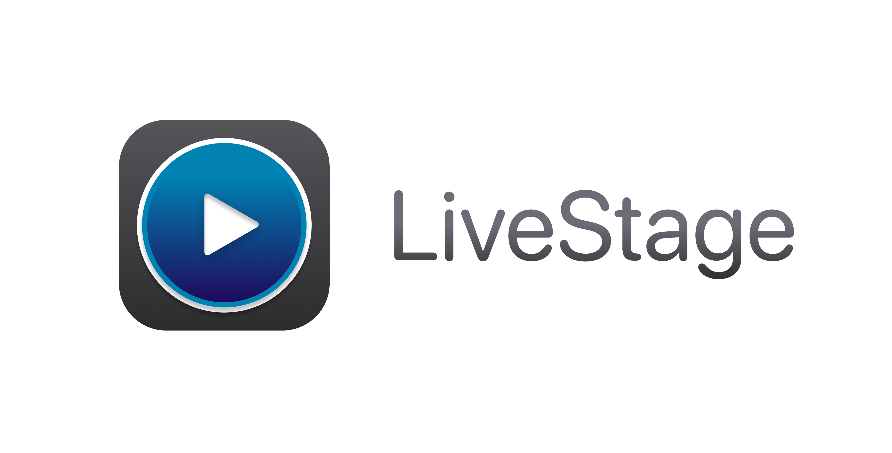

# LiveStage 

## 📝 Daily Updates

### 21-04-2025
  - Refactored Cue parent class into a protocol.
### 24-04-2025
  - Added AnyCue: a type-erased class that wraps any instance conforming to the Cue protocol.

## Core Functionality (TO DO)
- **Cue System**
  - Implement standard cues
    - Audio [❌]
      - [AVFoundation](https://developer.apple.com/documentation/avfoundation)
      - [Superpowered](https://superpowered.com)
    - Video [❌✅ to be polished]
      - [AvKit](https://developer.apple.com/documentation/avkit)
      - [AVFoundation](https://developer.apple.com/documentation/avfoundation)
    - Lights [❌]
      - [OLA (Open Lighting Architecture)](https://www.openlighting.org)
    - Countdown Timer [❌]
      - [Samuel782/Timer](https://github.com/Samuel782/timer)
    - PDF  [❌]
      - [PDFKit](https://developer.apple.com/documentation/pdfkit)
    - Websites [❌]
      - [WKWebView](https://developer.apple.com/documentation/webkit/wkwebview)
  - Create a *special cue type* with an integrated **timeline**  [❌]
    - Supports multiple sub-cues [❌]
    - Tempo-based (musical time) [❌]

- **Timecode Input**  [❌]
  - Support for SMPTE or custom timecode input / output [❌]
    - [TimecodeKit Lib](https://github.com/orchetect/TimecodeKit)
    - [LTC Timecode Wiki](https://en.wikipedia.org/wiki/Linear_timecode)
    - [MTC Timecode Wiki](https://en.wikipedia.org/wiki/MIDI_timecode)
      - [implementation](https://github.com/Figure53/TimecodeDisplay/tree/master)

- **Media Support Enhancements**  
  - Add support for additional media types:  
    - Audio files  [❌]
      - [AVAudioPlayer](https://developer.apple.com/documentation/avfaudio/avaudioplayer)
    - Websites [❌]
        - With controls for highliting, zooming in realtime from control window
        -  [WKWebView Tips](https://nshipster.com/wkwebview/)
        -  Realtime Highlighting → via DOM Injection (JavaScript bridge)
    - PDF documents  [❌]
        - With controls for highliting, zooming in realtime from control window 
    - LRC files (synchronized lyrics)  [❌]
      -[LRC-Parser example](https://github.com/anhthii/lrc-parser)
    - Webcam / external video inputs [❌]
      - [AVCaptureSession](https://developer.apple.com/documentation/avfoundation/avcapturesession)

- **Live Control Features**  
  - Countdown timer cue  [❌]
    - [Samuel782/Timer](https://github.com/Samuel782/timer)
  - MIDI & OSC input/output controls  [❌]
    - [CoreMidi](https://developer.apple.com/documentation/coremidi/)
    - [OSCKit](https://github.com/orchetect/OSCKit)
  - Art-Net DMX lighting control  [❌]
    - Support for fixtures & moving heads  [❌]
    - [Artnet Wiki](https://en.wikipedia.org/wiki/Art-Net)
    - [OLA (Open Lighting Architecture)](https://www.openlighting.org)
  - NDI video input/output  [❌]
    - [NDI SDK](https://ndi.video/for-developers/ndi-sdk/)
    - [DistroAV (NDI sender exmple)](https://github.com/DistroAV/DistroAV)
  - Remote control via iPad, iPhone, or other Macs [❌]
    - [Bonjour / MultipeerConnectivity](https://developer.apple.com/documentation/multipeerconnectivity)
    - 

- **Advanced Audio Features**  
  - Multi-output audio routing  [❌]
    - [CoreAudio](https://developer.apple.com/documentation/coreaudio)
    - [AudioKit](https://www.audiokit.io)
  - Built-in audio mixer with **VST plugin support** [❌]
    - [DaisySP](https://github.com/electro-smith/DaisySP)
    - [VST3 SDK](https://www.steinberg.net/developers/)
