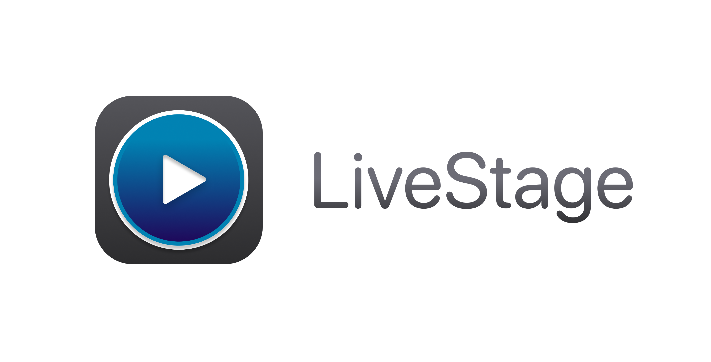

# LiveStage 

## 📝 Daily Updates

### 21-04-2025
  - Refactored Cue parent class into a protocol.
### 24-04-2025
  - Added AnyCue: a type-erased class that wraps any instance conforming to the Cue protocol.
	-	Added cueDuration to the Cue protocol
	  -	In VideoCue, it is calculated based on the video file length
### 25-04-2025
  - Added isSelected to the Cue protocol to represent whether the cue is selected in the view.
 	-	Added an icon to CueListRow (to be refined)
	-	Improved cue duration display (now formatted as M:SS)
### 27-04-2025
  - (FIX) Fixed double tap to open the cue edit window.
  - (ADD) Added support for importing multiple files at once.
  - (ADD) Moved CueList to a dedicated file.
  - (ADD) Cues in the list are now movable.
  - (FIX) Cues in the list can now be selected one at a time only.
  - (FIX) Only one editCue window can be open at a time.
  - (FIX) Videos now pause when a new video is played.
  - (ADD) Settings window added.
  - (FIX) automatic cue name now only includes the file name, not the entire path.

## Core Functionality (TO DO)
- **Cue System**
  - Implement standard cues
    - Audio [❌]
      - [AVFoundation](https://developer.apple.com/documentation/avfoundation)
      - [Superpowered](https://superpowered.com)
    - Video [❌✅ to be polished]
      - [AvKit](https://developer.apple.com/documentation/avkit)
      - [AVFoundation](https://developer.apple.com/documentation/avfoundation)
    - Lights [❌]
      - [OLA (Open Lighting Architecture)](https://www.openlighting.org)
    - Countdown Timer [❌]
      - [Samuel782/Timer](https://github.com/Samuel782/timer)
    - PDF  [❌]
      - [PDFKit](https://developer.apple.com/documentation/pdfkit)
    - Websites [❌]
      - [WKWebView](https://developer.apple.com/documentation/webkit/wkwebview)
  - Create a *special cue type* with an integrated **timeline**  [❌]
    - Supports multiple sub-cues [❌]
    - Tempo-based (musical time) [❌]

- **Timecode Input**  [❌]
  - Support for SMPTE or custom timecode input / output [❌]
    - [TimecodeKit Lib](https://github.com/orchetect/TimecodeKit)
    - [LTC Timecode Wiki](https://en.wikipedia.org/wiki/Linear_timecode)
    - [MTC Timecode Wiki](https://en.wikipedia.org/wiki/MIDI_timecode)
      - [implementation](https://github.com/Figure53/TimecodeDisplay/tree/master)
  *Update 27/04/25: Clarification* — Timecode input acts as a trigger for cues. _See Cue Trigger chapter for more details._

- **Media Support Enhancements**  
  - Add support for additional media types:  
    - Audio files  [❌]
      - [AVAudioPlayer](https://developer.apple.com/documentation/avfaudio/avaudioplayer)
    - Websites [❌]
        - With controls for highliting, zooming in realtime from control window
        - [WKWebView Tips](https://nshipster.com/wkwebview/)
        - Realtime Highlighting → via DOM Injection (JavaScript bridge)
    - PDF documents  [❌]
        - With controls for highliting, zooming in realtime from control window 
    - LRC files (synchronized lyrics)  [❌]
      - [LRC-Parser example](https://github.com/anhthii/lrc-parser)
    - Webcam / external video inputs [❌]
      - [AVCaptureSession](https://developer.apple.com/documentation/avfoundation/avcapturesession)

- **Live Control Features**  
  - Countdown timer cue  [❌]
    - [Samuel782/Timer](https://github.com/Samuel782/timer)
  - MIDI & OSC input/output controls  [❌]
    - [CoreMidi](https://developer.apple.com/documentation/coremidi/)
    - [OSCKit](https://github.com/orchetect/OSCKit)
  - Art-Net DMX lighting control  [❌]
    - Support for fixtures & moving heads  [❌]
    - [Artnet Wiki](https://en.wikipedia.org/wiki/Art-Net)
    - [OLA (Open Lighting Architecture)](https://www.openlighting.org)
  - NDI video input/output  [❌]
    - [NDI SDK](https://ndi.video/for-developers/ndi-sdk/)
    - [DistroAV (NDI sender exmple)](https://github.com/DistroAV/DistroAV)
  - Remote control via iPad, iPhone, or other Macs [❌]
    - [Bonjour / MultipeerConnectivity](https://developer.apple.com/documentation/multipeerconnectivity)

- **Cue Trigger**  
  Cues can be triggered in various ways:
  
  - 🎛️ **Manually**  
    Triggered by the user via the software interface.

  - 🎹 **MIDI**  
    Triggered by receiving specific MIDI messages such as Note On, Control Change, or Program Change.

  - 🌐 **OSC**  
    Triggered by Open Sound Control (OSC) messages sent from compatible devices or software.

  - ⏱️ **Timecode**  
    Triggered automatically based on incoming timecode (LTC/MTC/Internal) signals.

  - 🎧 **Audio Trigger**  
    Triggered by detecting audio events or thresholds from an input signal.

  - 🍏 **Remote Control**  
    Triggered using connected remote devices like iPad, iPhone, or other Macs.

- **Advanced Audio Features**  
  - Multi-output audio routing  [❌]
    - [CoreAudio](https://developer.apple.com/documentation/coreaudio)
    - [AudioKit](https://www.audiokit.io)
  - Built-in audio mixer with **VST plugin support** [❌]
    - [DaisySP](https://github.com/electro-smith/DaisySP)
    - [VST3 SDK](https://www.steinberg.net/developers/)

## Requirements 
    - OS: MacOS 13+

## END USER LICENSE AGREEMENT (EULA)

*IMPORTANT* – READ CAREFULLY: This End-User License Agreement ("Agreement") is a legal agreement between you (either an individual or a single entity) and Samuel Luggeri, the author and owner of the software product "LiveStage" ("Software").

By installing, copying, or otherwise using the Software, you agree to be bound by the terms of this Agreement.

1. LICENSE GRANT
You are granted a non-exclusive, non-transferable, revocable license to install and use one copy of the Software on a single device, solely for personal or professional use, according to the terms herein.

2. RESTRICTIONS
You may not:
- Modify, adapt, translate, reverse engineer, decompile, or disassemble the Software.
- Redistribute, resell, rent, lease, sublicense, or otherwise transfer the Software to any third party.
- Share your license key or access credentials with others.
- Use the Software in any manner that violates applicable law.

3. COPYRIGHT
The Software is protected by copyright laws and international treaties. All title, ownership, and intellectual property rights in and to the Software remain with the author, Samuel Luggeri.

4. NO WARRANTY
This Software is provided "AS IS", without warranty of any kind, express or implied. The author does not guarantee that the Software will meet your requirements or operate without interruption or errors.

5. LIMITATION OF LIABILITY
In no event shall the author be liable for any damages arising out of the use or inability to use the Software, even if advised of the possibility of such damages.

6. TERMINATION
This Agreement is effective until terminated. You may terminate it at any time by deleting the Software and all copies. This Agreement will terminate automatically if you fail to comply with any term or condition.

7. GOVERNING LAW
This Agreement shall be governed by the laws of Italy, without regard to conflict of laws principles.

© 2025 Samuel Luggeri. All rights reserved.
